# Nextcloud LAN HTTPS Security Demo

A secure, self-hosted Nextcloud server configured to run over HTTPS within a local network (LAN).  
This project is part of my home lab, designed to enhance my skills in Linux server administration, networking, and cybersecurity.

---

## 🚀 Features

- 📂 Private file hosting and sharing with Nextcloud
- 🔐 HTTPS secured via self-signed certificate or LAN-compatible CA
- 📸 Step-by-step visual guide with screenshots

---

## 📸 Step-by-Step Screenshots

A full walkthrough of the setup and usage process.

### 1. Updating system Packages
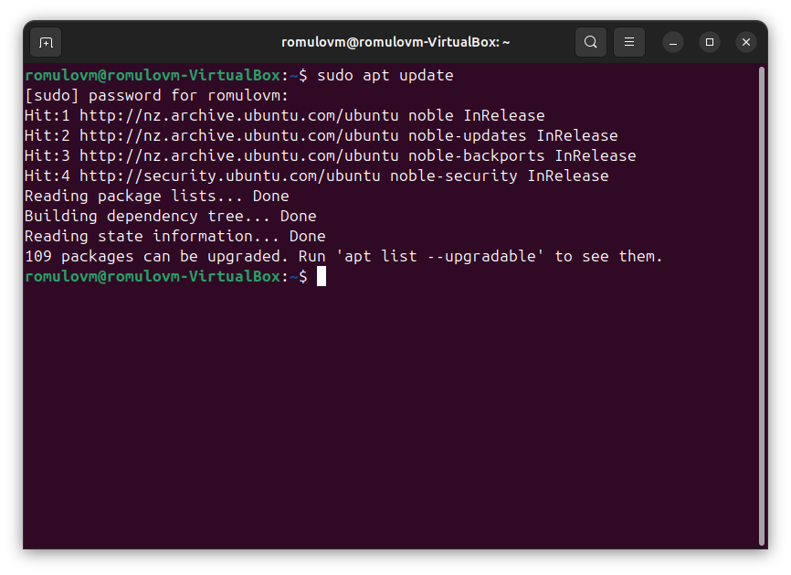

### 2. Downloading NextCloud
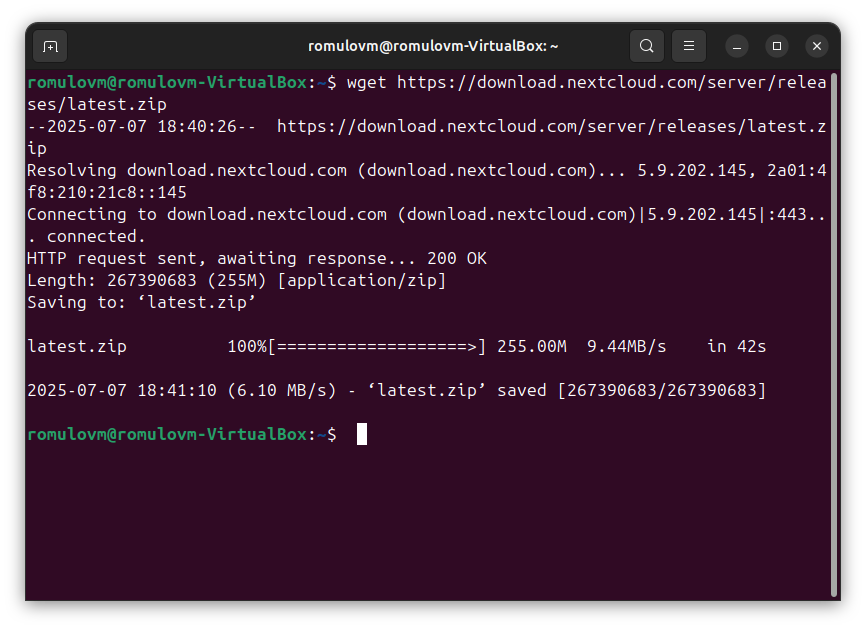

### 3. Moving NextCloud Folder
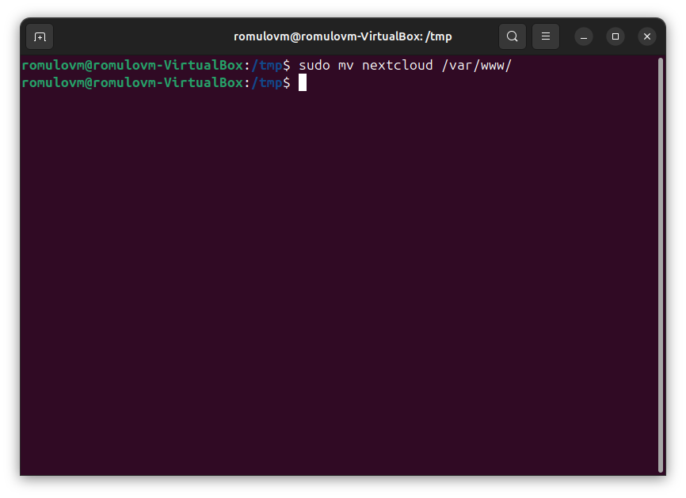

### 4. Installing Apache, Maria and PHP extensions
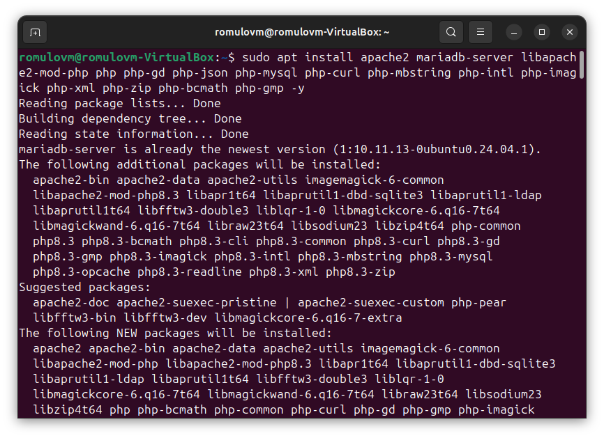

### 5. Configuring NextCloud database (Mariadb)
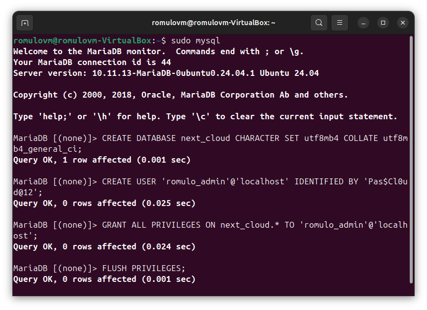

### 6. Setting Permissions
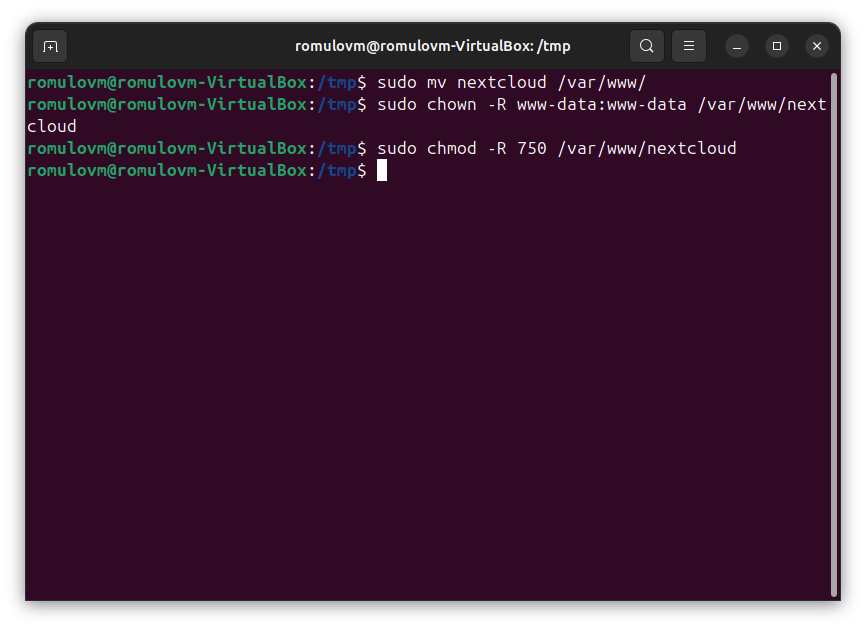

### 7. Creating Apache configuration 
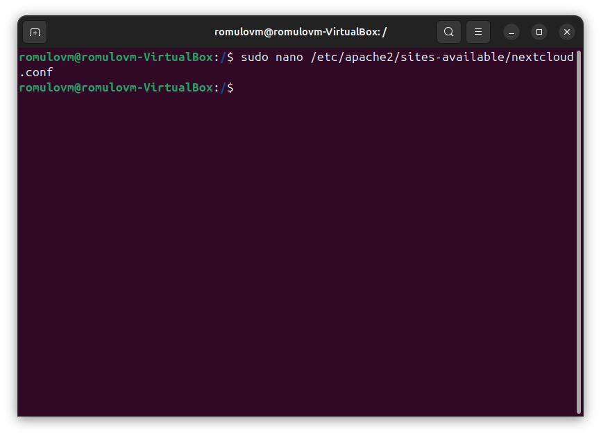
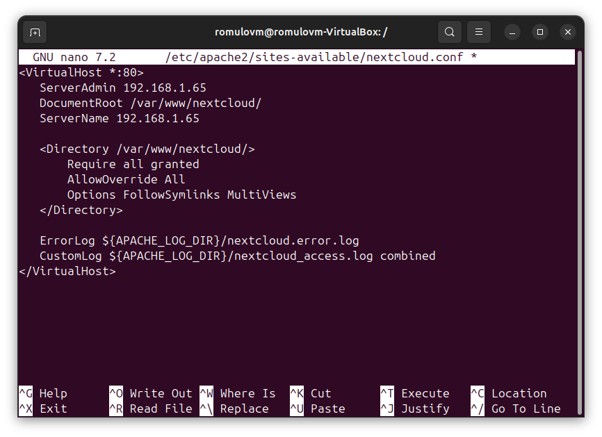

### 8. Enabling Apache modules and site
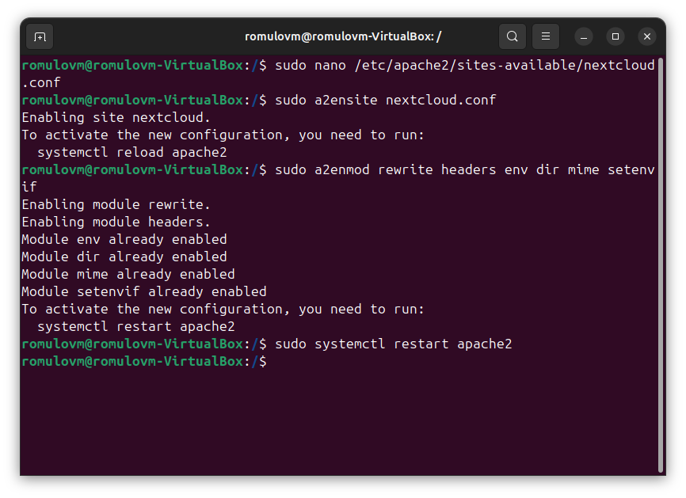

### 9. Installation completed
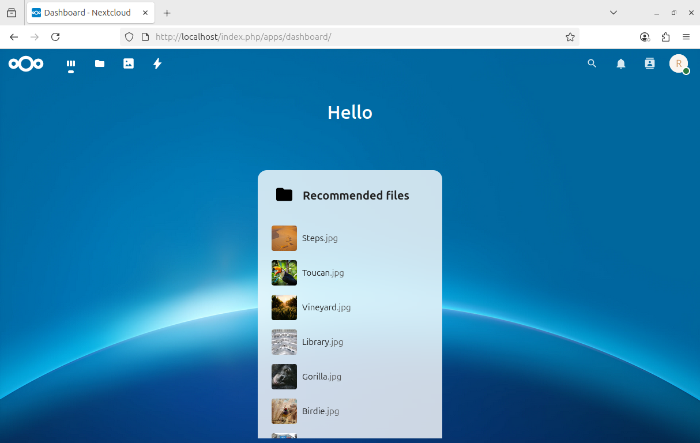

### 10. DHCP Reservation setup (Router)
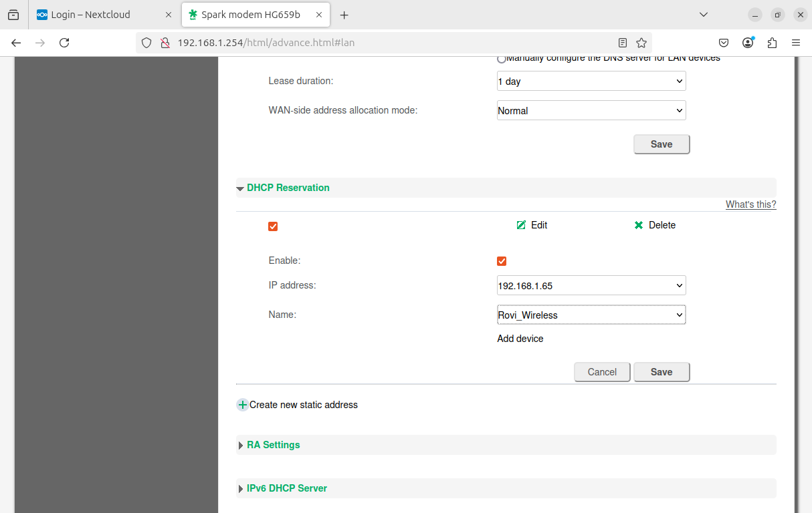

### 11. Adding a Local Hostname
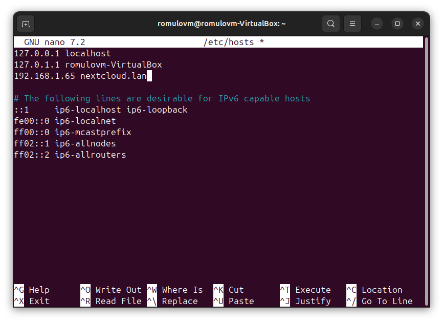

### 12. Editing Apache configuration file
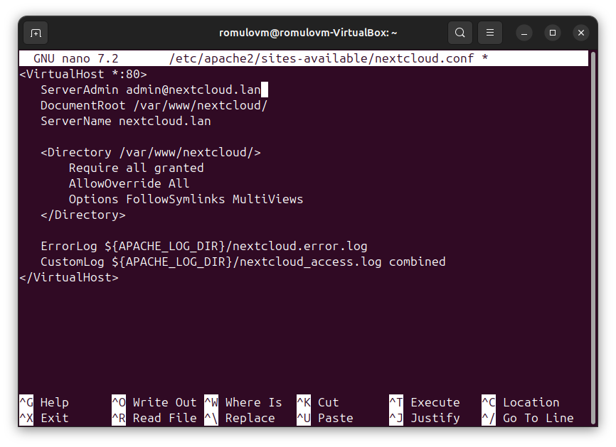

### 13. Testing connection security with wireshark
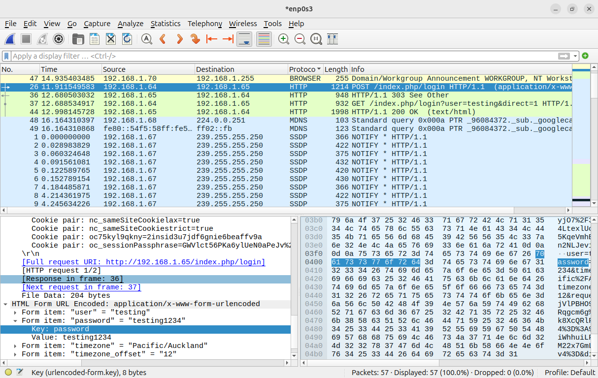

### 14. HTTPS Configuration (Self-Signed Certificate)
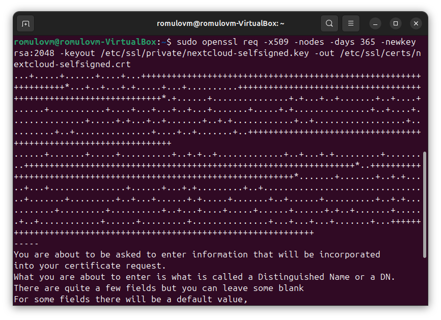

### 15. Creating a New Apache HTTPS Virtual Host
 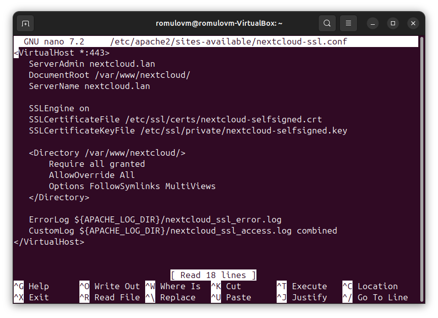

### 15. Enabling HTTPS Site
 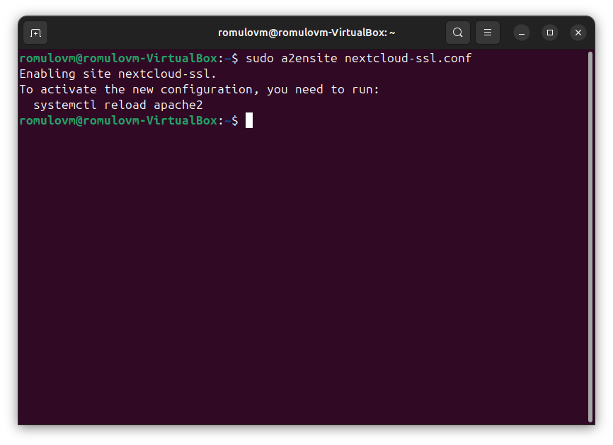

### 16. Testing HTTPS connection security with wireshark
   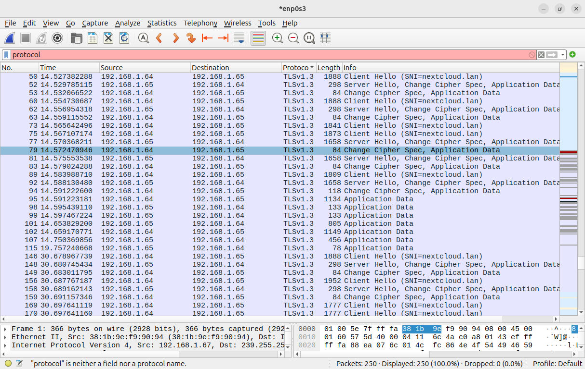

---

## 🛠️ Technologies Used

- **Ubuntu Server 24.04**
- **Docker & Docker Compose**
- **Nextcloud (latest)**
- **Nginx (reverse proxy)**
- **OpenSSL (self-signed certs)**

---

## 🔐 Security Summary

- HTTPS enforced with local certificates
- Removed default credentials after setup
- System hardened as part of cybersecurity practice

---
